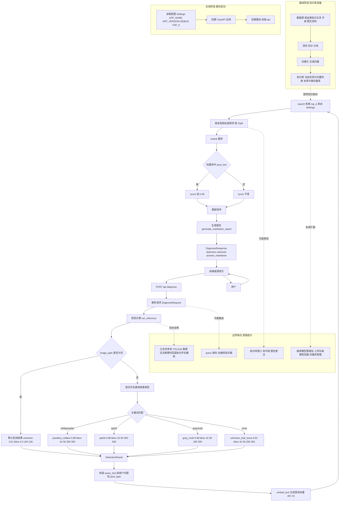

# 面向浆果种植的多模态RAG系统 (Berry-MRAG-System)

[](https://opensource.org/licenses/MIT)
[](https://www.python.org/downloads/)
[](https://github.com/ultralytics/ultralytics)

> **大连理工大学大学生创新创业训练计划**
> 
> **项目编号**：20261014110987 

## 📖 项目简介

本项目旨在构建一个能够综合利用文本、图像、视频等多模态数据的检索增强生成（MRAG）系统，为浆果种植提供精准、高效的智能决策支持 。

通过创新的“感知 - 认知 - 生成”混合式 AI 工作流 ，系统将帮助浆果种植户有效获取和利用农业知识，降低种植风险，推动智慧农业的发展与数字化转型 。

## ✨ 核心功能与预期指标

* **📸 多模态交互**：支持农户通过文本提问（如“草莓叶子有白色粉末怎么办”）或上传拍摄的病虫害部位图像进行交互 。
* **🩺 高精度视觉诊断**：采用微调的 YOLOv8 模型，病虫害诊断准确率预期 ≥85% 。
* **🧠 智能决策与生成**：结合多模态大语言模型（MLLM），生成图文并茂的防治方案（含推荐农药、剂量、安全间隔期等），并可结合环境数据生成个性化水肥管理方案 。
* **⚡ 高效跨模态检索**：实现文本匹配图像、图像关联文本的高效检索，检索延迟预期 ≤1 秒，结果相关性达标率预期 ≥90% 。

## 🛠️ 技术栈选型

* **视觉检测基础模型**：YOLOv8 
* **多模态处理与生成**：CLIP / LLaVA 
* **向量存储与检索引擎**：FAISS / Milvus 
* **数据预处理**：Python, OpenCV (用于构建高质量视觉数据集) 

## 📂 项目结构

```text
berry-mrag-system/
├── data/
│   ├── raw/               # 原始数据（预留）
│   ├── processed/         # 处理后数据（预留）
│   ├── chunks/            # 文本块数据（预留）
│   └── vector_store/      # 向量库存储（预留）
├── docs/                  # 项目文档
├── visual_module/         # 视觉诊断模块
├── rag_module/            # 检索增强生成模块
├── backend/               # FastAPI 后端服务
├── frontend/              # 前端目录（预留）
├── requirements.txt       # 环境依赖
└── UPDATE_LOG.md          # Codex 追加式更新日志

```

## 🚀 快速启动

### 1. 克隆仓库

```bash
git clone [https://github.com/Berry-MRAG-Team/berry-mrag-system.git](https://github.com/Berry-MRAG-Team/berry-mrag-system.git)
cd berry-mrag-system

```

### 2. 配置环境

建议使用 Conda 创建虚拟环境：

```bash
conda create -n berry-mrag python=3.10
conda activate berry-mrag
pip install -r requirements.txt

```

*(注：仓库已提供 `.env.example`，请复制为 `.env` 后按本机环境填写关键配置。)*


## 📅 项目开发进度规划

* **第一阶段：多模态数据处理与基础流水线搭建**
  * 编写 Python 脚本进行视觉数据的清洗、尺寸缩放与标准化，构建高质量的 YOLOv8 训练数据集。
  * 开发文本解析模块，将科学论文、技术规程等文档自动化切分并转化为标准化的“知识块”（chunks）。
  * 提取并结构化农药使用剂量、安全间隔期等表格化数据。

* **第二阶段：高精度视觉诊断模块开发**
  * 编写模型训练脚本，完成 YOLOv8 模型的定制化微调与验证。
  * 实现视觉诊断推理接口，确保能够准确输出病虫害类别标签、置信度以及位置坐标。

* **第三阶段：多模态检索增强生成（MRAG）核心逻辑开发**
  * 编写代码集成 CLIP 等多模态嵌入模型，将文本块、图像统一编码为高维向量。
  * 部署并配置 FAISS 或 Milvus 向量数据库，开发向量存储与高效相似性检索（Top-K 召回）的核心代码。
  * 开发二次重排（Rerank）逻辑，并构建 Prompt 工程模块，将多模态上下文信息与用户查询打包，与多模态大语言模型（MLLM）进行接口对接与结果生成。

* **第四阶段：全栈系统集成与交互界面开发**
  * 后端开发：使用相关框架将视觉诊断模块和 MRAG 模块封装为稳定、高效的 API 服务。
  * 前端开发：构建 Web 前端应用程序，开发图像上传、文本交互以及图文并茂诊断报告渲染的用户界面。
  * 开发极简交互模式与离线功能，确保系统在离线状态下仍能调用本地核心知识库。

* **第五阶段：系统调优、测试与自动化迭代**
  * 针对复杂场景编写多维度检索过滤的代码逻辑，优化多模态语义对齐，提升检索精准度。
  * 进行系统级性能测试与并发调优，确保跨模态检索延迟控制在 1 秒以内。
  * 开发知识库自动更新接口，支持后续新文档和方案的动态接入。


## 当前可运行版本（MVP 骨架）

已提供可运行的后端最小链路：
- `POST /api/diagnose`：接收文本问题、可选图片路径与可选过滤参数，返回诊断结果、检索结果与 Markdown 建议。
- `GET /api/health`：服务健康检查。

启动方式：

```bash
pip install -r requirements.txt
uvicorn backend.main:app --reload --port 8000
```

## YOLOv8 本地推理（无需外部 API）

`visual_module/inference.py` 已支持本地 YOLOv8 推理：
- 优先使用本地模型进行真实检测；
- 若未安装 YOLO 依赖、模型加载失败或图片不存在，则自动回退到当前占位逻辑（按文件名关键词猜测）。
- 仅放行业务类别（`powdery_mildew`、`aphid`、`gray_mold`），其余类别自动回退为 `unknown_leaf_issue`。

可通过环境变量控制：

```bash
# 模型权重路径（可用 yolov8n.pt / 你的自训练 best.pt）
YOLO_MODEL_PATH=yolov8n.pt

# 设备：NVIDIA 显卡建议 cuda:0，CPU 可设为 cpu
YOLO_DEVICE=cuda:0

# 推理阈值
YOLO_CONF=0.25
YOLO_IOU=0.45

# 业务阈值：低于该值或类别不在业务白名单时，统一回退 unknown_leaf_issue
YOLO_BUSINESS_CONF=0.45
```

Windows PowerShell 示例：

```powershell
$env:YOLO_MODEL_PATH = "yolov8n.pt"
$env:YOLO_DEVICE = "cuda:0"
$env:YOLO_CONF = "0.25"
$env:YOLO_IOU = "0.45"
$env:YOLO_BUSINESS_CONF = "0.45"
uvicorn backend.main:app --reload --port 8000
```

## YOLOv8 本地训练（产出 best.pt）

1. 准备数据集配置文件：
   - 复制 `docs/berry_yolo_data.example.yaml`
   - 重命名为 `data/processed/berry_yolo_data.yaml`
   - 按你的实际数据目录修改 `path/train/val/test`

2. 启动训练（默认输出到 `runs/yolo/berry-disease`）：

```bash
python -m visual_module.train_yolo \
  --data data/processed/berry_yolo_data.yaml \
  --model yolov8n.pt \
  --device 0 \
  --epochs 100 \
  --batch 16 \
  --imgsz 640
```

3. 训练完成后使用最佳权重进行后端推理：

```powershell
$env:YOLO_MODEL_PATH = "D:/0code/berry-mrag-system/runs/yolo/berry-disease/weights/best.pt"
$env:YOLO_DEVICE = "cuda:0"
uvicorn backend.main:app --reload --port 8000
```

调用示例：

```bash
curl -X POST "http://127.0.0.1:8000/api/diagnose" \
  -H "Content-Type: application/json" \
  -d "{\"query\":\"草莓叶片有白色粉末怎么办\",\"image_path\":\"demo_powder.jpg\"}"
```

带过滤参数的调用示例（可选）：

```json
{
  "query": "请给出防治方案",
  "image_path": "D:/0code/berry-mrag-system/data/raw/strawberry_powdery_mildew.jpg",
  "crop": "草莓",
  "disease_hint": "powdery_mildew"
}
```

## RAG 检索数据接入（本地 chunks）

`rag_module/retriever.py` 已升级为本地知识块检索：
- 优先读取 `data/chunks/*.json` 或 `data/chunks/*.jsonl`；
- 若未提供 chunks，则回退读取 `docs/berry_manual.md`；
- 若仍无可用数据，则回退到内置最小知识库；
- 检索索引与向量缓存会落到 `data/vector_store/`。

支持的 chunks 字段：`id`、`title`、`content`（至少要有 `content`）。

`json` 示例（数组）：

```json
[
  {
    "id": "chunk-001",
    "title": "草莓白粉病防治",
    "content": "加强通风，发病初期按标签喷施三唑类药剂。"
  }
]
```

`jsonl` 示例（每行一个 JSON 对象）：

```jsonl
{"id":"chunk-001","title":"草莓白粉病防治","content":"加强通风，发病初期按标签喷施三唑类药剂。"}
{"id":"chunk-002","title":"灰霉病管理","content":"清理病残体，控制湿度，开花期预防用药。"}
```

### 从手册自动生成 chunks

可使用脚本将 `docs/berry_manual.md` 自动转为结构化 `jsonl`：

```bash
python -m rag_module.build_chunks \
  --input docs/berry_manual.md \
  --output data/chunks/berry_manual_chunks.jsonl
```

生成字段包括：`id/title/content/source/crop/disease_cn/disease_en/symptom/treatments/pesticide/dose/interval_days/keywords`。

### 使用百炼 Embedding（Qwen3-Embedding）

在环境变量中配置：

```powershell
$env:DASHSCOPE_API_KEY = "你的Key"
$env:EMBEDDING_MODEL = "text-embedding-v4"
$env:EMBEDDING_DIM = "1024"
```

说明：
- `rag_module/embedder.py` 已支持通过 OpenAI 兼容接口调用百炼 Embedding。
- 若接口不可用会自动回退到本地哈希向量（保证服务可用）。

### RAG 离线评测（Recall/MRR/nDCG/延迟）

1. 准备评测集（JSONL），可参考：`docs/eval_queries.example.jsonl`

2. 运行评测脚本：

```bash
python -m rag_module.eval_retrieval \
  --eval-file docs/eval_queries.example.jsonl \
  --top-k 3 \
  --mode both \
  --out-json data/vector_store/eval_report.json \
  --out-md docs/eval_report.md
```

3. 查看评测结果：
- 汇总 JSON：`data/vector_store/eval_report.json`
- 可读报告：`docs/eval_report.md`

## 🔁 系统流程图


